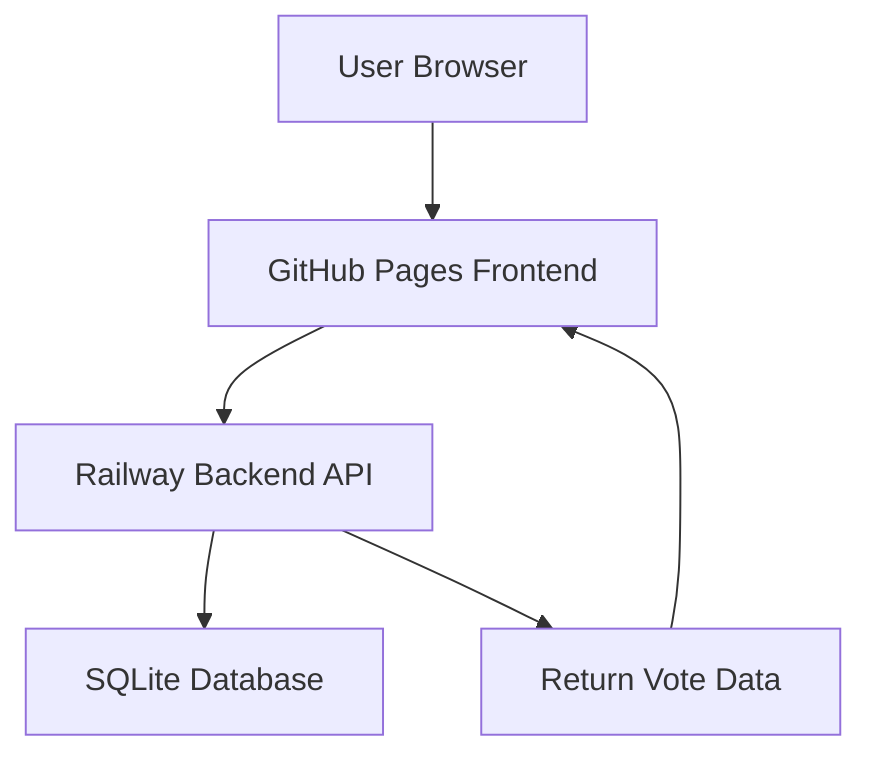
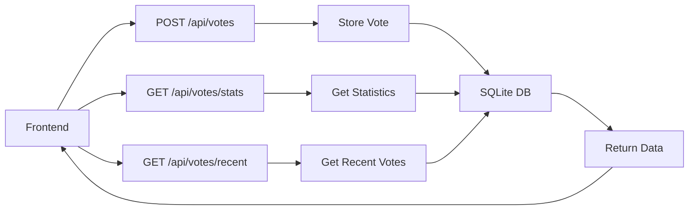
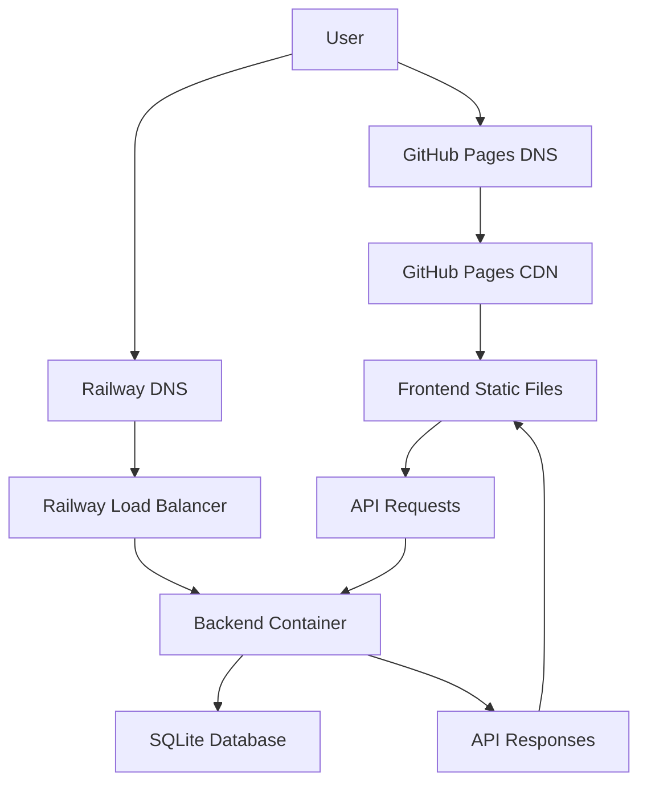

# System Architecture

## Overview

The ТВОРОЖНИКИ.РФ voting system consists of two main components:
1. Frontend (React + Vite) hosted on GitHub Pages
2. Backend (Node.js + Express) hosted on Railway

## Components

### Frontend (GitHub Pages)
- Static React application
- Hosted on GitHub Pages
- Communicates with backend API via fetch requests
- Implements voting UI and display of statistics

### Backend (Railway)
- Node.js + Express server
- RESTful API for vote submission and retrieval
- SQLite database for data storage
- CORS enabled for frontend communication

### Data Flow

1. User visits the website (served from GitHub Pages)
2. User submits a vote through the frontend
3. Frontend sends vote data to Railway backend API
4. Backend validates and stores vote in SQLite database
5. Backend returns confirmation to frontend
6. User can view statistics that are fetched from the backend

## API Endpoints

## Deployment Architecture

## Security Considerations

- Browser fingerprinting to prevent duplicate votes
- CORS configuration to allow only frontend requests
- Input validation on all API endpoints
- No sensitive data stored in the database